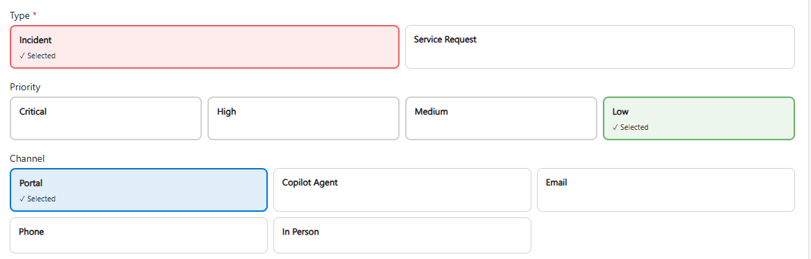
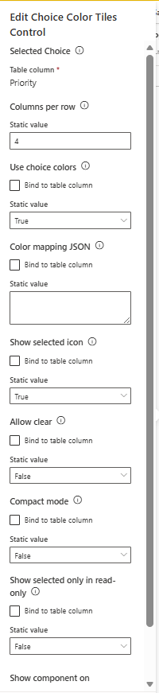
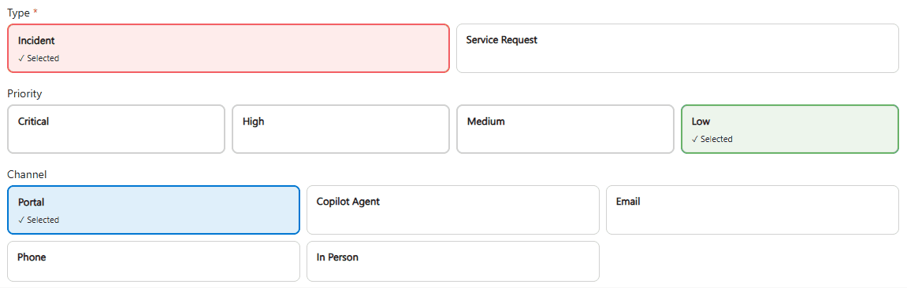

# Choice Color Tiles

Componente PCF genérico para representar opciones de Dataverse mediante tarjetas visuales de color, ofreciendo una experiencia de selección más clara, moderna y fácil de interpretar para usuarios finales.

El componente está diseñado para funcionar de forma reutilizable en distintos escenarios de Power Platform, sin depender de nombres específicos de tablas, campos o esquemas de un entorno concreto.

## Características

- Visualización de opciones mediante tarjetas de color.
- Representación clara del valor seleccionado.
- Indicadores visuales configurables por opción.
- Experiencia de selección más amigable que un Choice estándar.
- Compatibilidad con campos de tipo Choice / OptionSet.
- Configuración flexible para adaptar colores, estilos y comportamiento.
- Diseño reutilizable para diferentes tablas y procesos de Dataverse.
- Experiencia visual orientada a formularios de Model-Driven Apps.
- Soporte para escenarios donde el color ayuda a identificar estados, prioridades, tipos o clasificaciones.
- Diseño limpio, ligero y alineado con experiencias modernas de Power Platform.

## Tecnologías utilizadas

- Power Platform
- Dataverse
- Power Apps Component Framework
- TypeScript
- React
- Fluent UI

## Requisitos

- Power Platform CLI
- Node.js
- Visual Studio Code
- Entorno de Dataverse
- Tabla con columna de tipo Choice / OptionSet
- Permisos para importar soluciones y personalizar formularios

## Configuración del componente

- Namespace: `BizzAppsHub`
- Constructor: `Jonathan Manrique`
- Tipo de control: PCF de campo
- Uso recomendado: Model-Driven Apps
- Campo principal recomendado: Choice / OptionSet

## Tipos de campo recomendados

- Campo principal: Opción / Choice
- Etiqueta auxiliar: Texto
- Orden visual: Número
- Color visual: Valor configurado desde Choice, JSON o lógica del componente

## Instalación

1. Clona el repositorio.

```bash
git clone https://github.com/jmanriquerios1/power-platform-resources.git
```

2. Accede a la carpeta del componente.

```bash
cd power-platform-resources/resources/pcf/pcf-choice-color-tiles
```

3. Instala las dependencias.

```bash
npm install
```

4. Compila el componente.

```bash
npm run build
```

5. Despliega el componente en Dataverse usando Power Platform CLI.

```bash
pac pcf push
```

También puedes importar el componente mediante la solución disponible en GitHub Releases.

## Uso

1. Abre la tabla donde existe la columna de tipo Choice.
2. Accede al formulario principal de la tabla.
3. Selecciona la columna Choice que deseas representar visualmente.
4. Agrega el componente `Choice Color Tiles`.
5. Configura las propiedades disponibles del control.
6. Publica los cambios del formulario.
7. Abre la Model-Driven App y valida la experiencia de selección.
8. Ajusta colores, orden visual y comportamiento según la necesidad funcional.

## Escenarios de uso

Este componente puede utilizarse en escenarios como:

- Estado de solicitudes.
- Prioridad de casos.
- Clasificación de activos.
- Tipo de requerimiento.
- Severidad de incidencias.
- Categorías de atención.
- Niveles de aprobación.
- Fases simples de trabajo.
- Segmentación visual de registros.
- Cualquier campo Choice donde el color mejore la comprensión del usuario.

## Ejemplos funcionales

### Estado

Puede utilizarse para representar valores como:

- New
- In Progress
- Waiting
- Completed
- Cancelled

### Prioridad

Puede utilizarse para representar valores como:

- Low
- Normal
- High
- Critical

### Clasificación

Puede utilizarse para representar valores como:

- Internal
- External
- Confidential
- Public

## Capturas







## Descarga

Descarga la última versión desde GitHub Releases.

## Solution

[Descargar Choice Color Tiles v1.0.0](https://github.com/jmanriquerios1/power-platform-resources/releases/tag/pcf-choice-color-tiles-v1.0.0)

## Limitaciones

- Requiere que los valores de opción estén correctamente definidos en Dataverse.
- La experiencia visual depende de la configuración de colores disponible.
- La accesibilidad visual depende del contraste entre texto, fondo e indicadores de color.
- No modifica los metadatos del Choice.
- No ejecuta automatizaciones, cloud flows ni lógica de negocio externa.
- No actualiza campos adicionales del formulario.
- No reemplaza validaciones de negocio configuradas en Dataverse.
- El componente debe configurarse sobre columnas compatibles de tipo Choice / OptionSet.

## Recomendaciones

- Utilizar colores con contraste suficiente para garantizar legibilidad.
- Evitar depender únicamente del color para comunicar significado.
- Mantener nombres de opciones claros y comprensibles para usuarios finales.
- Validar el comportamiento en modo edición y solo lectura.
- Probar el componente en formularios reales de Model-Driven Apps antes de publicarlo en producción.
- Usar una paleta consistente con el diseño de la solución o la marca del proyecto.

## Licencia

MIT License.

## Autor

Jonathan Manrique
