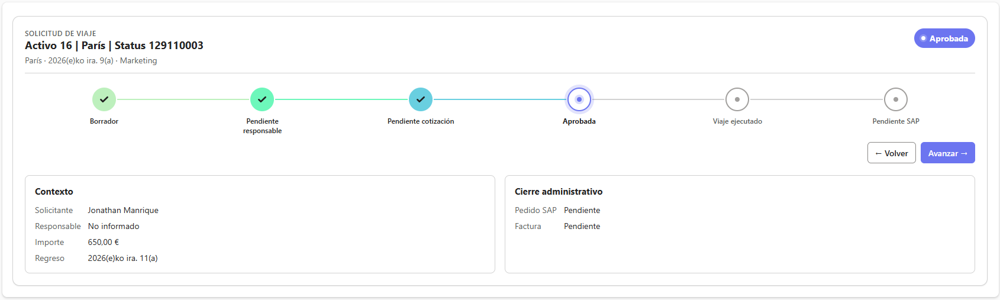
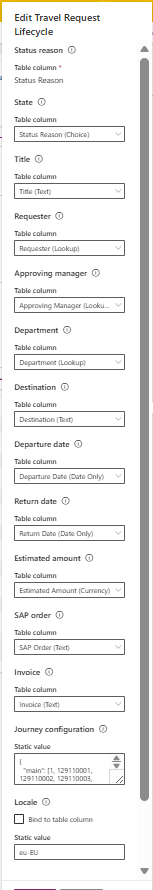
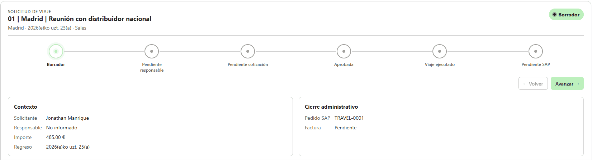

# Generic Choice Journey Control

Componente PCF estándar para transformar cualquier columna Dataverse de tipo Choice u OptionSet en una experiencia visual de recorrido, progreso y selección de estado.

El control no depende de tablas, columnas ni valores de negocio concretos: obtiene las opciones desde los metadatos del campo enlazado y permite ordenar visualmente la secuencia mediante JSON.

> Importante: el journey es una representación visual. No representa historial de auditoría, duración de estados ni transiciones reales ejecutadas en Dataverse.

---

## Metadatos

- Documento: `README-PCF-GENERIC-CHOICE-JOURNEY-CONTROL`
- Componente: `Generic Choice Journey Control`
- Versión documentada: `1.0.0`
- Estado: Producción / Documentación técnica
- Namespace: `GenericChoiceJourney.Controls`
- Constructor: `GenericChoiceJourneyControl`
- Tipo de control: PCF estándar de campo
- Campo principal recomendado: Choice / OptionSet
- Plataforma objetivo: Power Platform / Dataverse / Model-Driven Apps

---

## Propósito del control

Generic Choice Journey Control convierte una columna Choice de Dataverse en un recorrido visual accesible. Ayuda a identificar el valor actual, las opciones disponibles, su orden visual y las etapas anteriores o posteriores.

Puede utilizarse para estados, prioridades, severidad, fases, clasificaciones, madurez o cualquier Choice donde una secuencia aporte contexto.

---

## Advertencia importante sobre el journey visual

Las etapas anteriores, actuales y posteriores se calculan únicamente con el orden visible y el valor enlazado. El control no afirma ni calcula:

- Historial de cambios ni auditoría.
- Duración o fecha de transición.
- Flujo real de negocio.
- Transiciones permitidas.

Para ello, implementa una extensión independiente con Dataverse auditing, plugins, cloud flows, Custom APIs o reglas de negocio.

---

## Características

- Visualización de opciones Choice como etapas de un recorrido.
- Compatibilidad con cualquier tabla Dataverse y Choice compatible.
- Lectura dinámica de etiquetas y colores de metadatos.
- Orden explícito seguro, sin deducir progreso por valor numérico.
- Sobrescritura de etiquetas y colores mediante JSON.
- Ocultación de opciones sin modificar Dataverse.
- Solo lectura por defecto; edición explícitamente habilitable.
- Limpieza opcional del valor.
- Título, descripción y resumen opcionales.
- Diseño responsive, foco visible y `prefers-reduced-motion`.
- Sin Web API, servicios externos ni modificación de otros campos.

---

## Diferencias frente a un selector Choice estándar

Un Choice estándar permite seleccionar un valor pero comunica poco contexto. Este control:

- Convierte opciones en etapas visuales.
- Distingue el valor actual dentro de una secuencia.
- Permite controlar el orden sin cambiar los metadatos.
- Mantiene el vínculo con la columna Dataverse y el modo del formulario.
- Evita hardcoding de entidades, columnas y valores.

---

## Tecnologías utilizadas

- Power Platform y Dataverse
- Power Apps Component Framework
- TypeScript y React
- CSS
- Jest
- Power Platform CLI

---

## Requisitos

- Power Platform CLI y Node.js.
- Visual Studio Code.
- Entorno Dataverse con una columna Choice / OptionSet.
- Permisos de lectura y, si procede, edición sobre el campo.
- Solución Power Platform y una Model-Driven App para el despliegue.

---

## Configuración del componente

- Namespace: `GenericChoiceJourney.Controls`
- Constructor: `GenericChoiceJourneyControl`
- Tipo: PCF estándar de campo
- Carpeta del control: `GenericJourneyControl`
- Propiedad principal: `selectedChoice`
- Uso recomendado: Model-Driven Apps

---

## Alcance incluido

Incluye lectura de metadatos Choice, selección opcional del valor enlazado, orden, etiquetas, colores y opciones ocultas configurables mediante JSON, resumen opcional, estilos responsive y pruebas unitarias del servicio de journey.

---

## Fuera de alcance

No incluye historial, Audit History, workflows, cloud flows, Custom APIs, reglas de transición, cambios de otros campos, modificación de metadatos, Web API, servicios externos, iconos, confirmación de cambio ni una propiedad de orientación.

---

## Arquitectura y flujo de datos

```text
Dataverse Choice / OptionSet Field
                |
                v
      PCF Standard Lifecycle Adapter
                |
                |-- Bound value
                |-- Field metadata
                |-- Disabled state
                |-- Control configuration
                v
          Journey Service
                |
                |-- Option values and labels
                |-- Metadata colours
                |-- JSON order and overrides
                v
          Choice Journey View
```

---

## Principios de diseño

1. **Universalidad:** no codifica entidades, columnas ni valores concretos.
2. **Claridad:** el valor actual y el orden deben ser evidentes.
3. **Progresión visual:** el orden no equivale a historial auditado.
4. **Accesibilidad:** la información no depende exclusivamente del color.
5. **Configuración segura:** JSON inválido no rompe el control.
6. **Rendimiento:** no realiza solicitudes remotas.
7. **Compatibilidad:** respeta el ciclo de vida PCF y el estado del formulario.

---

## Propiedades configurables

| Propiedad | Tipo | Descripción |
| --- | --- | --- |
| `selectedChoice` | OptionSet, bound | Valor Choice enlazado; obligatorio. |
| `journeyTitle` | SingleLine.Text | Título opcional. |
| `journeyDescription` | SingleLine.Text | Texto de ayuda opcional. |
| `journeyConfigJson` | Multiple | Orden, etiquetas, colores y opciones ocultas. |
| `allowChoiceChange` | TwoOptions | Permite seleccionar una etapa. |
| `allowClear` | TwoOptions | Permite limpiar el valor si se permite editar. |
| `showSummary` | TwoOptions | Muestra la selección bajo el recorrido. |
| `locale` | SingleLine.Text | Cultura BCP 47 para textos internos. |

---

## Estructura del proyecto

```text
pcf-status-journey-control/
|-- GenericJourneyControl/
|   |-- ControlManifest.Input.xml
|   |-- index.ts
|   |-- components/ChoiceJourneyView.tsx
|   |-- models/journey.ts
|   |-- services/journeyService.ts
|   |-- styles/GenericChoiceJourneyControl.css
|   |-- tests/journeyService.test.ts
|   |-- generated/ManifestTypes.d.ts
|-- package.json
|-- pcf-generic-choice-journey-control.pcfproj
|-- README.md
```

---

## Instalación

1. Clona el repositorio y accede al componente.

```bash
git clone https://github.com/jmanriquerios1/power-platform-resources.git
cd power-platform-resources/resources/pcf/pcf-status-journey-control
```

2. Instala, genera los tipos, compila y valida.

```bash
npm install
npm run refreshTypes
npm run build
npm run lint
npm test
```

3. Empaqueta el componente en una solución y despliega el artefacto en Dataverse.

---

## Uso en Model-Driven Apps

1. Abre el formulario de una tabla con una columna Choice.
2. Selecciona la columna y agrega `Generic Choice Journey`.
3. Enlaza `Choice column` con la columna Choice.
4. Configura título, descripción, resumen y permisos de edición.
5. Usa `Journey configuration JSON` para definir la secuencia real.
6. Publica y valida en modo edición y solo lectura.

---

## Configuración básica recomendada

- `selectedChoice`: columna Choice enlazada.
- `journeyTitle`: título breve del proceso o clasificación.
- `journeyConfigJson`: orden explícito cuando sea necesario.
- `allowChoiceChange`: `false` para consulta; `true` para edición.
- `allowClear`: solo si el campo puede quedar vacío.
- `showSummary`: `true` cuando convenga repetir el valor seleccionado.
- `locale`: `es-ES` o la cultura requerida.

---

## Ejemplo de `journeyConfigJson`

```json
{
  "order": [100000000, 100000002, 100000001],
  "labels": { "100000002": "En revisión" },
  "colors": { "100000002": "#2563EB" },
  "hiddenOptionValues": [100000099]
}
```

---

## Reglas de `journeyConfigJson`

- `order` contiene los valores numéricos de OptionSet en orden visual.
- Las opciones no incluidas quedan al final en el orden de metadatos.
- Las claves de `labels` y `colors` son valores serializados como texto.
- Los colores solo se aplican si son hexadecimales válidos.
- `hiddenOptionValues` elimina las opciones de la secuencia visible.
- Los valores desconocidos e información inválida se ignoran de forma segura.
- La configuración no ejecuta código ni modifica los metadatos.

---

## Ejemplo de `colorMappingJson` por valor

En este control se define dentro de `journeyConfigJson.colors`:

```json
{
  "colors": {
    "100000000": "#2563EB",
    "100000001": "#F59E0B",
    "100000002": "#16A34A"
  }
}
```

---

## Ejemplo de `colorMappingJson` por etiqueta

No se admite color por etiqueta: los colores se asocian al valor numérico, que es estable entre idiomas.

---

## Prioridad de resolución de colores

1. Color hexadecimal válido en `journeyConfigJson.colors`.
2. Color de metadatos de la opción Choice.
3. Color de respaldo de la hoja de estilos.

---

## Estados visuales de las etapas

| Estado | Comportamiento visual |
| --- | --- |
| Previous | Opción anterior a la selección en el orden visible. |
| Current | Opción cuyo valor coincide con el campo enlazado. |
| Next | Opción posterior a la selección. |
| Hidden | No se renderiza. |
| Unknown | El valor actual no coincide con una opción visible. |
| Read-only | Se muestra sin permitir cambios. |
| Disabled | El formulario no permite interacción. |
| Focused | Muestra foco visible para teclado. |

---

## Reglas del motor de journey

- Lee las opciones de los metadatos de `selectedChoice`.
- Aplica primero el orden JSON y conserva después las opciones restantes.
- Excluye las opciones ocultas.
- Identifica el valor actual por valor numérico, nunca por etiqueta.
- No deduce orden de los números ni transiciones permitidas.
- No sustituye un valor desconocido por una etapa diferente.

---

## Comportamiento de campos obligatorios y opcionales

### Campo obligatorio

La columna enlazada es obligatoria para el control. La obligatoriedad real del dato la impone Dataverse y el formulario.

### Campo opcional

Para limpiar una columna opcional, habilita `allowChoiceChange` y `allowClear`. La plataforma valida finalmente si el campo puede quedar vacío.

---

## Comportamiento editable, deshabilitado y solo lectura

### Editable

Solo se permite seleccionar cuando `allowChoiceChange` es `true` y el formulario no está deshabilitado.

### Deshabilitado

Si `context.mode.isControlDisabled` es `true`, el control no emite cambios.

### Solo lectura

Por defecto, `allowChoiceChange` es `false` y el control solo presenta la secuencia.

---

## Confirmación de cambio

La versión actual no solicita confirmación. Si se necesita, debe añadirse mediante una extensión o lógica del formulario.

---

## Navegación mediante teclado

- Los elementos editables reciben foco.
- `Tab` y `Shift+Tab` siguen el orden del navegador.
- `Enter` o `Espacio` activan la opción focalizada cuando es editable.
- El foco no depende únicamente del color.

---

## Accesibilidad

- El estado se comunica con texto y no solo color.
- El foco debe ser visible.
- Los colores deben conservar contraste suficiente.
- Se respetan las preferencias de movimiento reducido.
- La vista de solo lectura no comunica una acción disponible.

---

## Estados del sistema

- **Sin opciones:** el campo no expone opciones en sus metadatos.
- **Sin selección:** un campo opcional no tiene valor.
- **Valor desconocido:** el valor actual no coincide con opciones visibles.
- **Configuración inválida:** se usa una degradación segura.
- **Deshabilitado:** el formulario no permite cambios.

---

## Diseño visual

El control presenta un recorrido compacto y adaptable al espacio asignado por PCF. Los estilos están centralizados en `GenericChoiceJourneyControl.css`.

---

## Contenedor general

- Se adapta al ancho asignado por el formulario.
- No depende de ventanas emergentes ni recursos externos.
- Mantiene una jerarquía entre encabezado, etapas y resumen.

---

## Encabezado premium

- `journeyTitle` aporta un título opcional.
- `journeyDescription` añade contexto.
- Si no hay texto configurado, el encabezado no debe añadir ruido visual.

---

## Nodo de etapa

- Representa una opción visible de Choice.
- Usa el valor numérico como identidad estable.
- Muestra etiqueta de metadatos o la sobrescritura configurada.
- Puede usar color de metadatos o color JSON válido.
- No comunica edición si ésta no está habilitada.

---

## Conectores y progreso

El recorrido comunica el orden configurado y distingue visualmente la etapa actual. No calcula ni persiste porcentaje, duración ni progreso de negocio.

---

## Etiquetas y descripciones

- Las etiquetas proceden de metadatos salvo `journeyConfigJson.labels`.
- Las sobrescrituras se asocian a valores y no a texto localizado.
- `journeyDescription` describe el control.
- `showSummary` muestra la opción actualmente seleccionada.

---

## Orientación horizontal

La vista prioriza el espacio horizontal proporcionado por los formularios Model-Driven. Con secuencias largas, debe priorizarse la legibilidad.

---

## Orientación vertical

No existe una propiedad de orientación vertical en la versión actual; la adaptación se realiza desde los estilos del componente.

---

## Confirmación de transición

No se incluye diálogo de confirmación. Cuando la edición está habilitada, la selección comunica directamente el valor pendiente al ciclo de vida PCF.

---

## Estados de interacción y transición

- La interacción requiere `allowChoiceChange`.
- Un cambio permanece pendiente hasta que la plataforma lo reconcilia.
- Un formulario deshabilitado no genera salidas.
- Los estilos respetan `prefers-reduced-motion`.

---

## Tema claro

Los estilos deben mantener contraste legible sobre superficies claras habituales de Model-Driven Apps.

---

## Tema oscuro

Los colores personalizados deben verificarse para conservar contraste suficiente cuando la plataforma aplique tema oscuro.

---

## Modo compacto

No se expone una propiedad de modo compacto; el diseño responde al ancho del contenedor.

---

## Tokens CSS

Los estilos están centralizados en `GenericJourneyControl/styles/GenericChoiceJourneyControl.css`. Las personalizaciones deben evitar recursos remotos.

---

## Calidad visual premium

- La selección debe distinguirse sin depender solo del color.
- Las etiquetas deben ser legibles con longitudes variables.
- No se cargan iconos, imágenes o fuentes desde URLs externas.
- La interacción no debe cambiar innecesariamente el tamaño del formulario.

---

## Localización

`locale` acepta una cultura BCP 47. Si no se configura, el control usa `es-ES` para idioma 3082 y `en-US` para el resto. Las etiquetas proceden de los metadatos localizados de Dataverse, salvo sobrescritura por valor.

---

## Rendimiento

- No usa Web API ni solicitudes de red.
- Resuelve opciones desde el contexto PCF.
- Procesa orden y sobrescrituras desde la configuración.
- Comunica cambios con `notifyOutputChanged` y `getOutputs`.
- Solicita el seguimiento del tamaño de contenedor a PCF.

---

## Seguridad y robustez

- `external-service-usage` está en `false`.
- No usa Web API ni recursos remotos.
- La configuración JSON no ejecuta código ni inserta HTML.
- El estado deshabilitado del formulario tiene prioridad.
- La configuración inválida degrada a metadatos disponibles.
- Solo se emiten valores para la columna Choice enlazada.

---

## Comandos útiles

Instalar dependencias:

```bash
npm install
```

Actualizar tipos:

```bash
npm run refreshTypes
```

Compilar, validar y probar:

```bash
npm run build
npm run lint
npm test
```

Limpiar artefactos:

```bash
npm run clean
```

---

## Ejemplos de uso

### Estado de solicitud

- New
- In Review
- In Progress
- Completed
- Cancelled

### Prioridad

- Low
- Normal
- High
- Critical

En este escenario el journey representa una escala, no una progresión temporal.

### Fase de proyecto

- Discovery
- Design
- Build
- Test
- Release

### Severidad

- Informational
- Minor
- Major
- Critical

### Clasificación

- Draft
- Internal
- Reviewed
- Approved
- Archived

---

## Capturas







---

## Descarga

[Descargar Generic-Journey-Control v1.0.0](https://github.com/jmanriquerios1/power-platform-resources/releases/tag/pcf-choice-Journey-PCF-v1.0.0)

---

## Solution

```powershell
pac solution init --publisher-name "YOUR_PUBLISHER" --publisher-prefix "prefix" --outputDirectory ..\Solution
pac solution add-reference --path .
dotnet build ..\Solution\Solution.cdsproj
```

---

## Limitaciones

- No guarda historial ni consulta Audit History.
- No ejecuta automatizaciones ni valida transiciones de negocio.
- No modifica otros campos ni metadatos.
- No usa Web API, servicios externos o recursos remotos.
- El orden se basa en JSON y después en metadatos.
- No admite color por etiqueta, iconos ni orientación vertical explícita.

---

## Solución de problemas

### El control no muestra opciones

Verifica que `selectedChoice` esté enlazada a un Choice válido, que el campo tenga opciones, que el formulario esté publicado, que el usuario tenga permisos y que `hiddenOptionValues` no oculte todo.

### El valor actual aparece como desconocido

Puede ocurrir cuando el valor ya no existe en metadatos, se ha ocultado mediante configuración, hay datos antiguos o el JSON no tiene el formato esperado.

### Los colores no se aplican

Comprueba que el JSON sea válido, que las claves de `colors` coincidan con valores de OptionSet y que los colores tengan formato hexadecimal.

### Una opción no se puede seleccionar

Verifica `allowChoiceChange`, el estado del formulario, los permisos de Dataverse y que la opción no esté oculta.

### El control no permite limpiar el valor

Habilita `allowChoiceChange` y `allowClear`, y confirma que el campo no sea obligatorio y pueda actualizarse.

### Las animaciones no aparecen

El navegador o sistema operativo puede tener movimiento reducido activo, o la interacción concreta puede no disponer de animación.

### El JSON genera advertencia de configuración

Comprueba que `order` y `hiddenOptionValues` contengan números, que `labels` y `colors` usen claves de valor y que los colores sean hexadecimales.

---

## Licencia

MIT License. Consulta [LICENSE](LICENSE).

---

## Autor

Jonathan Manrique
